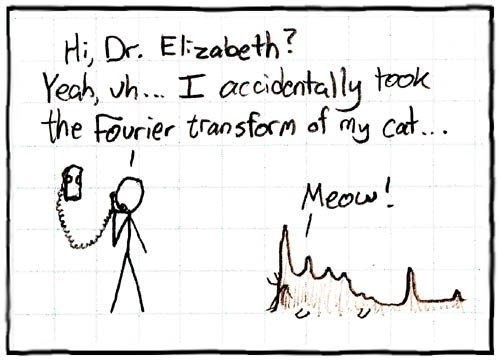

##
主宰这个世界的10种算法

######注：本文原地址[linux.cn](http://linux.cn/article-3125-1.html)

摘要: Reddit有篇帖子介绍了算法对我们现在生活的重要性，以及哪些算法对现代文明所做贡献最大。如果对算法有所了解，读这篇文章时你可能会问作者知道算法为何物吗？，或是Facebook的信息流(News Feed)算是一种算法吗？，如果信息流是算法，那就可以把所有事物都归结为一种算法。才疏学浅，结合那篇帖子，接下来我试着解释一下算法是什么，又是哪10个算法正在主导我们的世界。 什么是算法？ 简而言之，任何定义明确的计算步骤都可称为算法，接受一个或一组值为输入，输出一个或一组值。(来源：homas H. Cormen, Chales E. Leiserson 《算法导论 ...

Reddit有篇帖子介绍了算法对我们现在生活的重要性，以及哪些算法对现代文明所做贡献最大。如果对算法有所了解，读这篇文章时你可能会问“作者知道算法为何物吗？”，或是“Facebook的‘信息流’(News Feed)算是一种算法吗？”，如果“信息流”是算法，那就可以把所有事物都归结为一种算法。才疏学浅，结合那篇帖子，接下来我试着解释一下算法是什么，又是哪10个算法正在主导我们的世界。

###什么是算法？

简而言之，任何定义明确的计算步骤都可称为算法，接受一个或一组值为输入，输出一个或一组值。(来源：homas H. Cormen, Chales E. Leiserson 《算法导论第3版》)

可以这样理解，算法是用来解决特定问题的一系列步骤(不仅计算机需要算法，我们在日常生活中也在使用算法)。算法必须具备如下3个重要特性：

[1] 有穷性。执行有限步骤后，算法必须中止。

[2] 确切性。算法的每个步骤都必须确切定义。

[3] 可行性。特定算法须可以在特定的时间内解决特定问题，

其实，算法虽然广泛应用在计算机领域，但却完全源自数学。实际上，最早的数学算法可追溯到公元前1600年-Babylonians有关求因式分解和平方根的算法。

那么又是哪10个计算机算法造就了我们今天的生活呢？请看下面的表单，排名不分先后：

